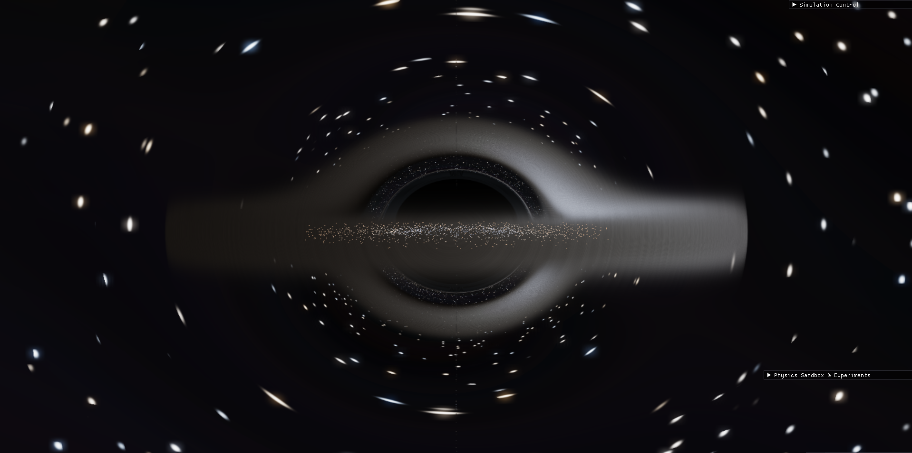
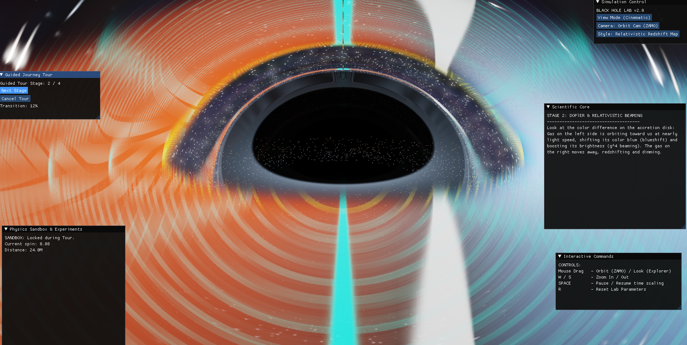
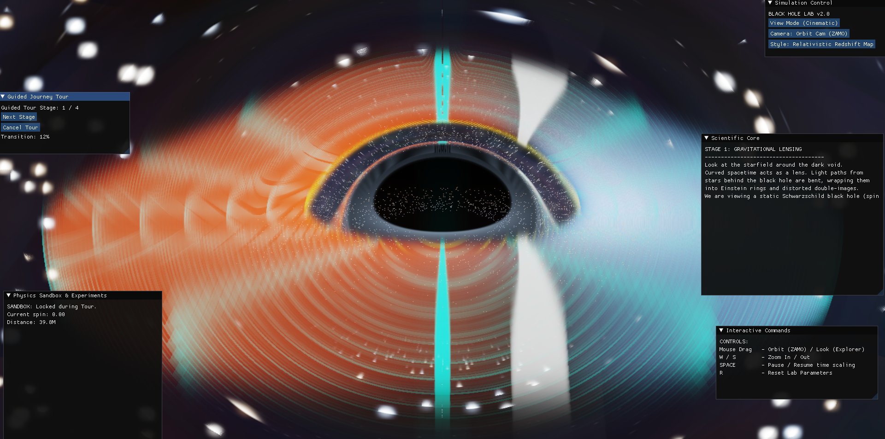
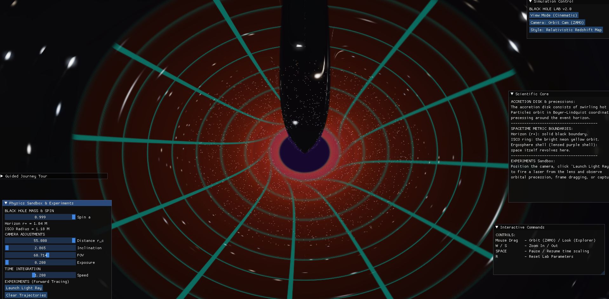

# 🕳️ Interactive Kerr Black Hole Simulator

What would it feel like to travel near a black hole?

KerrLab is an interactive simulation that lets you explore one of the strangest objects in the universe, a **rotating black hole**. Instead of only seeing black holes in pictures, you can move around one, change how it behaves, and watch space distort around it.

**Light bends, stars warp, the accretion disk glows, and the effects of extreme gravity become visible as you explore.** The simulator includes a cinematic mode for experiencing the black hole and a learning mode that explains the physics behind what is happening, from gravitational lensing to frame dragging.

Built with **Python** and **Taichi**, combining real-time rendering, general relativity concepts, and educational visualization.

This project aims to make black holes not just visible, but explorable, allowing users to experience gravitational lensing, relativistic effects, and the structure of a rotating black hole through an interactive scientific sandbox.

---
## 🎬 Preview


---

## 🎬 Demo Video

~Experience the simulator in action!

full detailed simulation:

▶️ (https://youtu.be/bVZbL7705Sg?si=PdYU8lgqboBivOSK)

1 minute preview(just visuals):

▶️(https://youtu.be/17Cz8rPHFvM)


---

---

## 📸 Screenshots

### 🕳️ Cinematic View


### 📚 Learn Mode — Relativistic Effects


### 🔭 Guided Journey — Gravitational Lensing


### 🔬 Physics Visualization Mode


---
## ✨ Features

### 🌌 Cinematic Black Hole Visualization

- Real-time black hole rendering
- Accretion disk visualization
- Deep space star environment
- Bloom and cinematic post-processing effects
- Immersive exploration camera

---

### 🕳️ Kerr Black Hole Physics

- Rotating black hole simulation concepts
- Event horizon calculation
- ISCO (Innermost Stable Circular Orbit) visualization
- Frame-dragging effects
- Relativistic spacetime visualization

---

### 🔭 General Relativistic Ray Tracing

- Photon trajectory simulation
- Backward ray tracing from observer camera
- RK4 numerical integration
- Gravitational lensing visualization

---

### 📚 Learn Mode

An educational mode designed for understanding black holes interactively.

Includes:

- Guided black hole exploration journey
- Scientific explanations
- Physics overlays
- Event horizon and ergosphere visualization
- Gravitational lensing explanations

---

### 🚀 Explorer Mode

Move around the simulation:

- Orbit camera
- Free-flight navigation
- Zoom and inspect black hole structures

---

### 🧪 Physics Sandbox

Experiment with:

- Black hole spin
- Camera position
- Time scaling
- Light ray trajectories

---

## 🛠️ Built With

- Python 3.12
- Taichi
- GPU acceleration
- Numerical physics simulation

---

## 📂 Project Structure

```
Blackhole-Simulator/

├── sim.py          # Main application loop
├── physics.py      # Kerr physics and geodesic calculations
├── renderer.py     # Rendering engine and visual effects
├── ui.py           # HUD, controls, learning mode
└── README.md
```

---

## ▶️ Running the Simulator

Install dependencies:

```bash
pip install taichi
```

Run:

```bash
python sim.py
```

For lower-end GPUs:

```bash
python sim.py --quality low
```

---

## 🎮 Controls

| Control | Action |
|---------|--------|
| Mouse Drag | Rotate camera / look around |
| W / S | Move or zoom |
| A / D | Strafe in explorer mode |
| Space | Pause simulation |
| ↑ / ↓ | Change time speed |
| R | Reset simulation |
| ESC | Exit simulator |

---

## 🎯 Goal

The goal of this project is to create a bridge between **scientific simulation** and **curiosity-driven exploration**.

Instead of only watching a black hole animation, users can experiment, explore, and learn how extreme gravity shapes the universe.

The simulator is designed to feel like a virtual astrophysics laboratory — combining cinematic visuals with interactive scientific learning.

---

## 🚧 Future Improvements

- More realistic accretion disk rendering
- Higher quality cinematic visualization
- Additional astrophysical objects
- Improved relativistic physics models
- More interactive experiments
- Performance optimization for different hardware

---

## ⭐ Project Vision

To make black holes understandable, explorable, and inspiring through interactive simulation.

**Explore the universe, one simulation at a time.** 🪐
